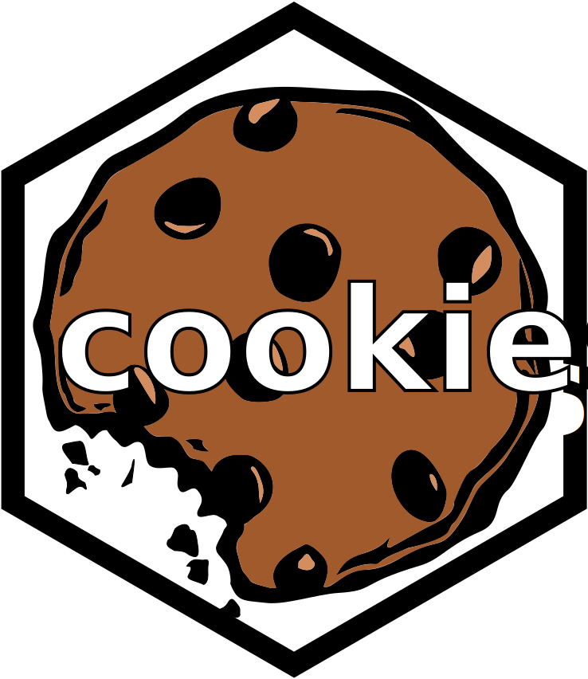

<!-- README.md is generated from README.Rmd. Please edit that file -->

```{r, include = FALSE}
knitr::opts_chunk$set(
  collapse = TRUE,
  comment = "#>",
  fig.path = "man/figures/README-",
  out.width = "100%"
)
```

# cookies <a href="https://shinyworks.github.io/cookies/"></a>

<!-- badges: start -->
[](https://lifecycle.r-lib.org/articles/stages.html#experimental)
[](https://CRAN.R-project.org/package=cookies)
[](https://app.codecov.io/gh/shinyworks/cookies?branch=main)
[](https://github.com/shinyworks/cookies/actions/workflows/R-CMD-check.yaml)
<!-- badges: end -->

Cookies are name-value pairs that are saved in a user's browser by a website. 
Cookies allow websites to persist information about the user and their use of the website.
The goal of {cookies} it to make it as easy as possible to use cookies in shiny apps.

## Installation

Install the released version of {cookies} from CRAN:

``` r
install.packages("cookies")
```

Or install the development version of {cookies} from [GitHub](https://github.com/) with:

``` r
# install.packages("pak")
pak::pak("shinyworks/cookies")
```

## Use Cases

Several potential use cases motivated the creation of this package.

### Saving Settings

In general, cookies can be used to save some sort of setting about the user.
This allows you to restore their state (or otherwise know something about that user) the next time they load your app.

Here we'll use a simple example to demonstrate this concept.

```{r simple-app, eval = FALSE}
library(cookies)
library(shiny)

# Wrap your ui with add_cookie_handlers() to enable cookies.
ui <- add_cookie_handlers(
  fluidPage(
    titlePanel("A Simple App"),
    fluidRow(
      sliderInput(
        "number_selector",
        label = paste(
          "Select a number.",
          "This selector sets the cookie value.",
          "It also initializes with the cookie value.",
          "Refresh to see it remembered.",
          sep = "\n"
        ),
        min = 1,
        max = 10,
        value = 1
      ),
      sliderInput(
        "number_selector_no_cookie",
        label = paste(
          "Select a number.",
          "This one is not connected to the cookie.",
          "When you refresh, it will always initialize to 1.",
          sep = "\n"
        ),
        min = 1,
        max = 10,
        value = 1
      )
    )
  )
)

server <- function(input, output, session) {
  # When the value changes, set a cookie.
  observeEvent(
    input$number_selector,
    {
      set_cookie(
        cookie_name = "selected_number",
        cookie_value = input$number_selector
      )
    }
  )

  # Initialize the top slider from any cookies that come in at the start.
  observeEvent(
    get_cookie("selected_number"),
    updateSliderInput(
      inputId = "number_selector",
      value = get_cookie("selected_number")
    ),
    once = TRUE
  )
}

shinyApp(
  ui,
  server,
  # Cookies only work in an actual browser.
  options = list(
    launch.browser = TRUE
  )
)
```

If you run that code, make selections, and refresh your browser, you should see that the first slider is remembered, while the second is not.

### Other Use Cases

-   **Authentication:** This was the motivating use case for this package. You can see a working example of how this can be implemented in [{shinyslack}](https://github.com/r4ds/shinyslack).
-   **Last visit:** You could log a datestamp when the page loads (and transfer any existing value to another variable or another cookie) to, for example, notify users about new features since their last visit.
-   **Many others:** If you have a use case but you aren't certain how to implement it, please open an issue!

## Code of Conduct

Please note that the cookies project is released with a [Contributor Code of Conduct](https://contributor-covenant.org/version/2/1/CODE_OF_CONDUCT.html). By contributing to this project, you agree to abide by its terms.
